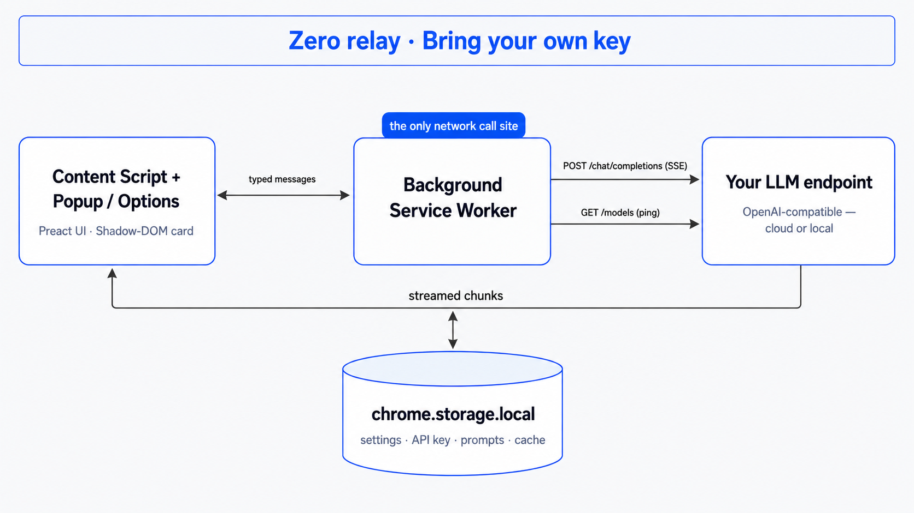

# BrowserTranslate

<p align="center">
  
</p>

[](https://github.com/Lewen-Cai/BrowserTranslate/releases/latest)
[](LICENSE)
[](https://github.com/Lewen-Cai/BrowserTranslate/actions/workflows/ci.yml)

**English** | [中文](./README_CN.md)

> Open-source, privacy-first browser translation extension. Bring your own LLM key. Zero relay, zero telemetry.

## Why

Existing translation extensions either lock LLM access behind paywalls, route your text through their servers, or hide the prompts that drive translation quality. BrowserTranslate is the opposite of all three.

- **Bring your own key** — works with any OpenAI-compatible API. Built in: OpenAI, Claude, Gemini, DeepSeek, Moonshot, Zhipu, Qwen, SiliconFlow, OpenRouter, Mistral, opencode. Local runtimes: LM Studio, Ollama, llama.cpp, vLLM. Anything else goes in as a custom endpoint.
- **Zero relay** — your text goes directly from your browser to the provider you configured. We have no server.
- **Zero telemetry** — no analytics, no error reporting, no remote logging
- **Open prompts** — the translation prompt is fixed but fully open source; the model judges register and topic on its own

## Features

- **Works with no API key** — Microsoft and Google are on out of the box, so a fresh install translates the moment it is loaded, at no cost. Add your own model whenever you want dictionary lookups or better prose. See the [note on the free engines](#a-note-on-the-free-engines) below.
- **Many providers at once, one per job** — configure as many as you like, then route each surface independently: the selection card, full-page translation and video subtitles can each use a different one. A free service for a whole page, your best model for the paragraph you care about.
- Selection-based translation with floating icon (or hotkey-only mode). The card names the languages it is working between, shows the source above the translation, and carries its own controls: switch provider or target language for that card alone, copy the result, or ask again. Those choices last as long as the card and are never written back to your settings. It can be pinned so it keeps its place while you scroll and clicks elsewhere don't dismiss it, and drags by its grip when it lands on top of what you were reading.
- Full-page bilingual translation — translates the main content of a page in place (navigation, headers and footers are left as-is), keeping the original above each translated block; renders progressively as you scroll (only the visible part is translated); blocks already in your target language are skipped; toggle from the popup ("Translate page" / "Show original"), or with the **Alt+A** hotkey in Hotkey trigger mode
- Streaming output via Server-Sent Events
- Providers are a searchable panel in Settings → Translation: switch one on, open it to fill in endpoint, key and model, and it reports its own latency from that row. Vendors with more than one region or plan offer those as a choice of endpoint — including opencode, whose Zen and Go plans are separate products with separate model catalogues. Local runtimes need no API key.
- Model thinking off by default — hybrid reasoning models (e.g. DeepSeek V4) reply fast without billing hidden reasoning tokens; a per-provider control turns thinking back on at five effort levels (Low / Medium / High / XHigh / Max), mapped to each vendor's native parameter (Claude, Gemini, DeepSeek, Zhipu, Qwen, SiliconFlow, OpenRouter, opencode)
- Dictionary mode — the model automatically decides whether a selection is a word/term to define or text to translate, in one streaming pass; dictionary results show the term's formal translation, pronunciation, part of speech, senses, and an example
- Settings export / import (Settings → Data) — save your config as JSON, import it on another device; API keys excluded by default (opt-in to include them)
- **Video subtitle translation** — Click the translate button (the languages icon) in the player's controls to open the subtitle menu, and turn on the switch to translate the video's existing captions. It works on YouTube, on Zoom cloud recordings, on Canvas course recordings, and on any player that ships its captions the standard way with a `<track>` element; where a player has no control bar we can join, the button takes a corner of the picture instead. Both lines are drawn over the player — original on top, translation below — and the grip above them drags the block anywhere in the picture; dragged past the middle it anchors to the top. The position is remembered, including in fullscreen, and the block lifts clear of the control bar while it is showing. Auto-generated (ASR) captions work as well as creator-provided tracks: ASR arrives a couple of words at a time, so those fragments are regrouped into sentences before translating. Only the cues around the playhead are translated, so subtitles start appearing within a second or two even on a long video, and scrubbing lands on the new position immediately. On YouTube, turn captions (CC) on first so the player loads the track; elsewhere nothing needs switching on. Where a transcript labels who is speaking, the name is kept out of the translation and put back verbatim — a model renders a transliterated name differently almost every time, and the same person arriving under a new name every few seconds is harder to follow than no names at all. Subtitle style — display mode (bilingual, original only, translation only), which line sits on top, backdrop opacity, and size, colour, font and weight for each line — is on the menu's "Subtitle style" page, and in Settings → Video. (Existing captions only — there is no audio speech-recognition.)
- Translation cache (configurable TTL)
- Light / dark appearance following the system or your choice; Latin text is set in JetBrains Mono, and CJK in Source Han Serif with a fallback stack chosen per language — Chinese, Japanese and Korean each get a face of their own rather than sharing one
- 34 target languages, chosen separately from the interface language — what you read in and what the extension speaks to you in are different questions
- UI available in 8 languages (Simplified/Traditional Chinese, English, Japanese, Korean, Spanish, French, German); auto-detects browser locale

## Architecture

<p align="center">
  
</p>

The background service worker is the **only** place that makes network calls — your text goes straight from your browser to the endpoint you configured, and your API key never touches the page. No relay server, ever.

## Install

### Chrome / Edge / Brave / Arc

1. Download the latest `.zip` from [Releases](https://github.com/Lewen-Cai/BrowserTranslate/releases)
2. Unzip
3. Open `chrome://extensions` → enable Developer mode → "Load unpacked" → select the unzipped folder

## Configure

A fresh install already translates — everything is routed to Microsoft, so you can select text and go. Everything below is for adding your own model.

1. Click the extension icon, then the settings button at its top-right.
2. Under **Translation → Providers**, find the vendor you want and switch it on. Open its row to fill in **Model** and **API Key** (a local runtime needs no key), and pick an endpoint if that vendor offers more than one region or plan. The row reports its own latency once it is on.
3. Under **General → Routing**, choose which provider answers for each surface: the **selection card**, **full-page translation**, and **subtitles**. They are independent — a free service is instant and costs nothing, which is what a whole page or an hour of subtitles wants, while a model reads context and is the only kind of provider that can answer a single word with a dictionary entry.
4. Select text on any webpage → click the blue icon → see the translation. (Prefer a keyboard shortcut? Set the trigger mode to **Hotkey** in settings — then your shortcut works instead of the icon.)

The popup keeps what you change often: target language, trigger mode, the page-translation toggle, and routing. Everything else — UI language, cache, subtitle appearance, data export — lives in the full settings page.

### A note on the free engines

The Microsoft and Google options call public translation endpoints (`edge.microsoft.com`, `translate-pa.googleapis.com`). Please understand what that means before relying on them:

- **They are not official APIs.** They are the endpoints those companies' own web and browser translation features use. There is no published contract for them.
- **This project is not affiliated with, sponsored by, or endorsed by Microsoft or Google.** Their names and marks belong to them and are used only to identify the service you are choosing.
- **They can change or stop working at any time**, without notice. If that happens, switch the engine in settings — your own API keeps working regardless.
- **Text you translate is sent to those services**, subject to their terms and privacy policies, not this project's. If that matters for what you are translating, use your own endpoint instead.
- **No warranty.** These options are provided as-is, and you use them at your own risk. If your use is commercial or high-volume, use the vendors' official, licensed APIs.

Routing defaults to Microsoft only so a fresh install does something useful. Routing a surface to your own provider removes all of the above for that surface.

## Develop

```bash
pnpm install
pnpm dev          # start dev build, watches src/, output in .output/
pnpm test         # run tests in watch mode
pnpm build        # production build
```

Load `.output/chrome-mv3-dev/` (dev) or `.output/chrome-mv3/` (prod) as an unpacked extension.

## Acknowledgements

- [read-frog](https://github.com/mengxi-ream/read-frog) (GPL-3.0) — thanks to this project, which we learned a lot from while building this extension. It is an excellent piece of work in its own right and well worth using — go give it a try.
- [Lobe Icons](https://github.com/lobehub/lobe-icons) (MIT) — the vendor marks shown next to each provider. Those marks are the trademarks of their respective owners and are used only to identify the service being selected.

## License

GPL-3.0. See [LICENSE](./LICENSE).

This license is chosen deliberately: derivative works must remain open-source, preventing the closed-source paywalled forks that motivated this project.
